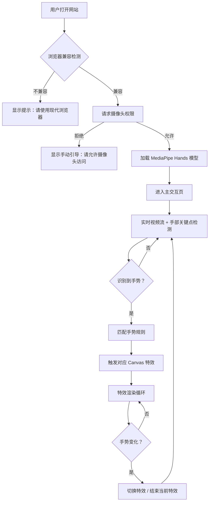

## 1. 产品概述

本项目是一个基于摄像头手势识别的交互式特效网站。用户打开网页后，通过摄像头捕捉手部动作，系统实时识别特定手势，并在屏幕上触发对应的炫酷视觉特效，创造沉浸式的"魔法"体验。

目标用户为追求新奇互动体验的年轻群体、科技爱好者以及需要互动展示/暖场活动的场景。

## 2. 核心功能

### 2.1 用户角色
| 角色 | 注册方式 | 核心权限 |
|------|----------|----------|
| 访客 | 无需注册 | 直接使用摄像头和全部手势特效 |

### 2.2 功能模块
1. **启动页**：引导用户授权摄像头、展示使用说明
2. **主交互页**：实时摄像头画面 + 手势识别 + 特效渲染
3. **手势图鉴页**：展示所有支持的手势及对应特效预览

### 2.3 页面详情
| 页面名称 | 模块名称 | 功能描述 |
|----------|----------|----------|
| 启动页 | 欢迎区域 | 品牌展示、动态背景、开始按钮 |
| 启动页 | 权限引导 | 摄像头授权请求、浏览器兼容性检测 |
| 启动页 | 使用说明 | 手势操作指南动画演示 |
| 主交互页 | 视频预览区 | 摄像头实时画面（可镜像翻转） |
| 主交互页 | 手势识别引擎 | MediaPipe Hands 实时手部关键点检测 |
| 主交互页 | 特效渲染层 | Canvas 2D 粒子/光效/几何变换系统 |
| 主交互页 | 状态面板 | 当前识别手势、特效名称、FPS 显示 |
| 手势图鉴页 | 手势卡片网格 | 每种手势的示意图与特效预览 |
| 手势图鉴页 | 详情弹窗 | 手势触发条件说明、特效参数展示 |

## 3. 核心流程

用户打开网站 → 浏览器检测 → 摄像头授权 → 进入主交互页 → MediaPipe 加载模型 → 实时检测手部 → 识别手势类型 → 触发对应特效 → 特效在 Canvas 上渲染 → 手势变化时切换特效

## 4. 用户界面设计

### 4.1 设计风格

- **整体风格**：赛博朋克 × 魔法科技（Cyber-Magic）
- **主色调**：深空黑 `#0a0a0f` 为底，霓虹青 `#00f0ff` 为主色，电光紫 `#b829ff` 为强调色
- **按钮样式**：发光边框 + 渐变填充，圆角 8px，hover 时外发光增强
- **字体选择**：
  - 标题：Orbitron（科幻感几何无衬线）
  - 正文：Noto Sans SC（清晰易读）
  - 特效文字：Share Tech Mono（等宽科技感）
- **布局风格**：全屏沉浸式，无传统导航栏，底部悬浮控制面板
- **图标风格**：线性图标 + 霓虹发光效果

### 4.2 页面设计概述

| 页面名称 | 模块名称 | UI 元素 |
|----------|----------|---------|
| 启动页 | 欢迎区域 | 全屏动态粒子背景（缓慢飘浮的光点）、居中大标题 "GESTURE MAGIC"、脉冲发光开始按钮 |
| 启动页 | 权限引导 | 半透明毛玻璃卡片、摄像头图标动画、授权按钮 |
| 启动页 | 使用说明 | 横向滑动手势示意图（3步：举手 → 做手势 → 看特效） |
| 主交互页 | 视频预览区 | 右下角小窗（16:9，圆角，带霓虹边框），默认镜像显示 |
| 主交互页 | 特效渲染层 | 全屏 Canvas，覆盖在视频层之上，手势触发时全屏特效 |
| 主交互页 | 状态面板 | 顶部悬浮条：左侧当前手势图标+名称，右侧 FPS 计数器 |
| 主交互页 | 控制面板 | 底部悬浮条：切换摄像头、镜像开关、音效开关、进入图鉴按钮 |
| 手势图鉴页 | 网格布局 | 2列卡片网格，每张卡片：手势名称 + 静态示意图 + 特效缩略动画 |
| 手势图鉴页 | 详情弹窗 | 毛玻璃弹窗，手势触发条件文字说明，特效参数滑块（仅展示） |

### 4.3 响应式设计
- **桌面优先**：全屏体验，所有功能完整呈现
- **平板适配**：手势图鉴改为单列，控制面板按钮间距调整
- **移动端**：视频预览区改为底部横条，控制面板简化，提示横屏使用以获得最佳体验

### 4.4 动画与动效
- **页面加载**：标题字符逐个淡入（stagger 50ms），背景粒子从中心向外扩散
- **按钮交互**：hover 时外发光从 0 到 8px 扩散，点击时产生涟漪效果
- **手势识别成功**：状态面板图标弹跳缩放（scale 1.2 → 1.0，弹性缓动）
- **特效切换**：当前特效淡出（300ms），新特效淡入（300ms）
- **摄像头授权成功**：预览窗从屏幕底部滑入（translateY 100% → 0，500ms，ease-out）

## 5. 支持的手势与特效映射

| 手势名称 | 手部姿态描述 | 触发特效 | 特效描述 |
|----------|-------------|----------|----------|
| 张开手掌 | 五指完全张开 | 粒子风暴 | 从手掌位置爆发彩色粒子，向外扩散 |
| 握拳 | 五指收拢握拳 | 冲击波 | 屏幕中心产生环形冲击波，向外扩散并淡出 |
| 竖起大拇指 | 仅大拇指竖起 | 上升光柱 | 从手掌底部向上喷射光柱粒子，如火箭尾焰 |
| 比耶/V字 | 食指+中指张开 | 双轨激光 | 两根手指指尖发射激光射线，带尾迹 |
| OK手势 | 拇指食指成环 | 漩涡吸收 | 环中心产生漩涡，周围粒子被吸入 |
| 手掌平推 | 手掌朝前平推 | 屏幕震动 | 画面产生震动效果，伴随裂纹纹理 |
| 食指指天 | 仅食指向上 | 天降光束 | 从屏幕顶部垂直降下光柱，照亮手掌区域 |
| 挥手 | 手掌左右摆动 | 波浪扩散 | 水平波浪形光效从手掌位置向两侧扩散 |
