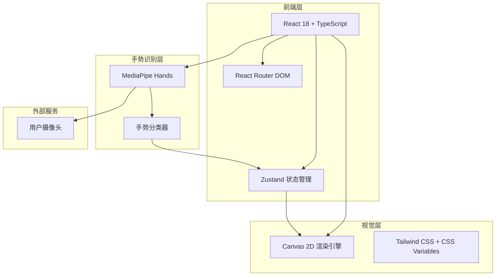

## 1. 架构设计



## 2. 技术描述

* **前端框架**：React\@18 + TypeScript + Vite

* **初始化工具**：vite-init（react-ts 模板）

* **状态管理**：Zustand

* **样式方案**：Tailwind CSS\@3 + 自定义 CSS Variables

* **手势识别**：@mediapipe/hands + @mediapipe/camera\_utils

* **特效渲染**：原生 Canvas 2D API（粒子系统、光效、几何变换）

* **路由**：react-router-dom

* **图标**：lucide-react

* **字体**：Google Fonts（Orbitron、Noto Sans SC、Share Tech Mono）

* **后端**：无（纯前端项目，所有计算在浏览器端完成）

## 3. 路由定义

| 路由       | 用途                    |
| -------- | --------------------- |
| /        | 启动页（欢迎 + 权限引导）        |
| /play    | 主交互页（摄像头 + 手势识别 + 特效） |
| /gallery | 手势图鉴页（所有手势与特效预览）      |

## 4. 项目结构

```
interact-website/
├── public/
│   └── fonts/              # 本地字体文件（备用）
├── src/
│   ├── components/
│   │   ├── ui/             # 基础 UI 组件（Button、Card、Modal）
│   │   ├── CameraPreview.tsx    # 摄像头预览组件
│   │   ├── EffectCanvas.tsx     # 特效 Canvas 渲染组件
│   │   ├── GestureStatusBar.tsx # 顶部状态面板
│   │   ├── ControlPanel.tsx     # 底部控制面板
│   │   ├── GestureCard.tsx      # 手势图鉴卡片
│   │   └── ParticleEffect/      # 各特效子组件
│   │       ├── ParticleStorm.tsx
│   │       ├── Shockwave.tsx
│   │       ├── LightPillar.tsx
│   │       ├── LaserBeam.tsx
│   │       ├── Vortex.tsx
│   │       ├── ScreenShake.tsx
│   │       ├── SkyBeam.tsx
│   │       └── WaveDiffusion.tsx
│   ├── hooks/
│   │   ├── useMediaPipe.ts      # MediaPipe Hands 初始化与检测
│   │   ├── useGestureClassifier.ts # 手势分类逻辑
│   │   ├── useCamera.ts         # 摄像头管理
│   │   └── useAnimationFrame.ts # 动画循环封装
│   ├── stores/
│   │   └── gestureStore.ts      # Zustand 全局状态
│   ├── pages/
│   │   ├── LandingPage.tsx      # 启动页
│   │   ├── PlayPage.tsx         # 主交互页
│   │   └── GalleryPage.tsx      # 手势图鉴页
│   ├── utils/
│   │   ├── gestureRules.ts      # 手势判定规则
│   │   ├── effects/             # 特效渲染工具函数
│   │   │   ├── particleSystem.ts
│   │   │   ├── laserRenderer.ts
│   │   │   └── waveRenderer.ts
│   │   └── constants.ts         # 常量定义
│   ├── types/
│   │   └── index.ts             # TypeScript 类型定义
│   ├── App.tsx
│   ├── main.tsx
│   └── index.css
├── .trae/documents/
├── index.html
├── package.json
├── tailwind.config.js
├── tsconfig.json
└── vite.config.ts
```

## 5. 核心模块设计

### 5.1 手势识别流程

```
Camera Stream → MediaPipe Hands → 21个手部关键点 → GestureClassifier → 手势类型
```

**手势分类逻辑**：

* 基于 21 个手部关键点的相对位置关系

* 计算手指伸展/弯曲状态（指尖到掌心的距离 vs 指根到掌心的距离）

* 匹配预定义的手势规则模板

* 加入防抖机制（连续 3 帧识别一致才确认手势变化）

### 5.2 特效渲染架构

```
EffectCanvas (主渲染循环)
├── requestAnimationFrame 循环
├── 当前激活的 Effect 实例
│   ├── update(dt)   // 更新粒子/光效状态
│   └── render(ctx)  // Canvas 2D 绘制
└── 手势切换时：销毁旧 Effect，创建新 Effect
```

**特效基类设计**：

```typescript
abstract class Effect {
  abstract update(deltaTime: number): void;
  abstract render(ctx: CanvasRenderingContext2D): void;
  abstract isComplete(): boolean;
  destroy(): void {}
}
```

### 5.3 状态管理（Zustand）

```typescript
interface GestureState {
  // 摄像头
  cameraEnabled: boolean;
  cameraMirrored: boolean;
  
  // 手势
  currentGesture: GestureType | null;
  gestureConfidence: number;
  
  // 特效
  activeEffect: EffectType | null;
  effectIntensity: number; // 0-1，基于手势保持时长
  
  // 系统
  fps: number;
  isModelLoaded: boolean;
  
  // Actions
  setCameraEnabled: (enabled: boolean) => void;
  setCurrentGesture: (gesture: GestureType | null, confidence: number) => void;
  setActiveEffect: (effect: EffectType | null) => void;
}
```

## 6. 性能优化策略

* **MediaPipe 配置**：使用 `modelComplexity: 1`（平衡精度与性能），`maxNumHands: 1`

* **Canvas 优化**：使用 `willReadFrequently: false`，特效粒子数量上限控制

* **离屏渲染**：复杂特效使用 OffscreenCanvas（Web Worker 中）

* **节流处理**：手势识别结果节流（每 100ms 更新一次状态）

* **懒加载**：MediaPipe 模型在启动页预加载，特效代码按需加载

